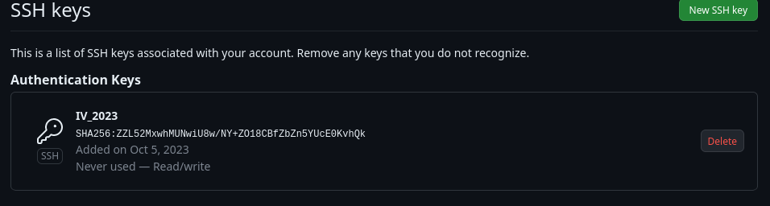

# Objetivo 0

Clonamos el repositorio que hemos creado para la asignatura:

Creamos el repositorio añadimos la licencia:

```bash
git clone https://github.com/eugrdfolcha/IV-2023.git

```
Configuramos la cuenta de usuario y el email del repositorio local:

```bash
dfolcha@pop-os:~/IV-2023$ git config user.name eugrdfolcha
dfolcha@pop-os:~/IV-2023$ git config user.name
eugrdfolcha
dfolcha@pop-os:~/IV-2023$ git config user.email e.dfolcha@go.ugr.es
dfolcha@pop-os:~/IV-2023$ ls
dfolcha@pop-os:~/IV-2023$ git config user.email
e.dfolcha@go.ugr.es
```
Creamos las claves ssh siguiendo la [documentación de github](https://docs.github.com/en/authentication/connecting-to-github-with-ssh):

```bash
dfolcha@pop-os:~/IV-2023$ ssh-keygen -t ed25519 -C e.dfolcha@go.ugr.es
```
Añadimos la clave ssh a la cuenta de github:




